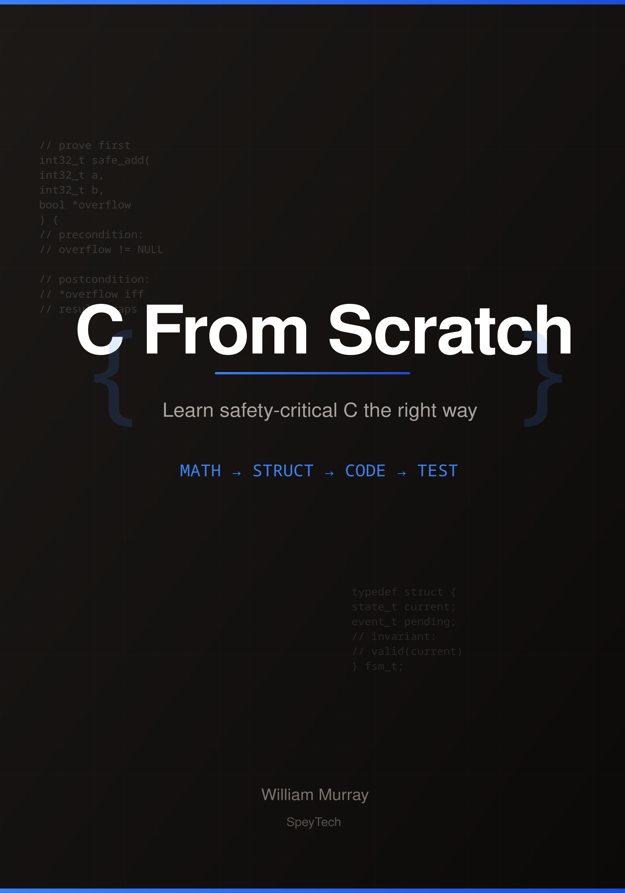

# C From Scratch

**Learn to build safety-critical systems in C.**

Not "Hello World". Real kernels. Mathematical rigour. Zero dependencies.

> *"Math → Struct → Code → Test"*

---

## 📘 The Book

<p align="center">
  
</p>

<p align="center">
  <strong><a href="https://leanpub.com/c-from-scratch">C From Scratch: Learn Safety-Critical C the Right Way</a></strong>
</p>

The complete guide to writing C that doesn't just work — it *provably* works.

**What you'll learn:**
- The MATH → STRUCT → CODE → TEST methodology
- Fixed-width integers and why `int` kills rockets (Ariane 5)
- Contracts, preconditions, and invariants
- State machines that can't enter invalid states
- Memory safety without garbage collection
- The path from learning to DO-178C / IEC 62304 / ISO 26262 certification

**What you won't find:**
- "It works on my machine"
- Undefined behaviour swept under the rug
- `malloc` in safety-critical code
- Tutorials that teach bad habits

📖 **[Buy the book on Leanpub →](https://leanpub.com/c-from-scratch)**

---

## Philosophy

Most tutorials teach you to write code that *seems* to work.  
This course teaches you to write code that *provably* works.

**The method:**
1. Define the problem mathematically
2. Prove correctness formally
3. Design structs that embody the proof
4. Transcribe the math into C
5. Test against the contracts

```
┌─────────────────────────────────────────────────────────────┐
│                    THE APPROACH                             │
├─────────────────────────────────────────────────────────────┤
│                                                             │
│   Problem  ──►  Math Model  ──►  Proof  ──►  Structs        │
│                                                │            │
│                                                ▼            │
│                           Verification  ◄──  Code           │
│                                                             │
└─────────────────────────────────────────────────────────────┘
```

---

## The Seven Foundation Modules

| Module | Question | Role | Tests |
|--------|----------|------|-------|
| [Pulse](./projects/pulse/) | Does it exist? | Sensor | ✓ |
| [Baseline](./projects/baseline/) | Is it normal? | Sensor | 18/18 |
| [Timing](./projects/timing/) | Is it regular? | Sensor | ✓ |
| [Drift](./projects/drift/) | Is it trending toward failure? | Sensor | 15/15 |
| [Consensus](./projects/consensus/) | Which sensor to trust? | Judge | 17/17 |
| [Pressure](./projects/pressure/) | How to handle overflow? | Buffer | 16/16 |
| [Mode](./projects/mode/) | What do we do about it? | Captain | 17/17 |

Plus: [Integration Example](./projects/integration/) — All modules working together.

---

## The Safety Stack

```
┌─────────────────────────────────────────────────────────────────────┐
│                    MODULE 7: MODE MANAGER                           │
│                       "The Captain"                                 │
│   Decides: What mode? What actions allowed?                         │
└─────────────────────────────────────────────────────────────────────┘
                              ↑
┌─────────────────────────────────────────────────────────────────────┐
│                    MODULE 6: PRESSURE                               │
│                       "The Buffer"                                  │
└─────────────────────────────────────────────────────────────────────┘
                              ↑
┌─────────────────────────────────────────────────────────────────────┐
│                    MODULE 5: CONSENSUS                              │
│                       "The Judge"                                   │
└─────────────────────────────────────────────────────────────────────┘
                              ↑
          ┌───────────────────┼───────────────────┐
          ▼                   ▼                   ▼
┌─────────────────┐ ┌─────────────────┐ ┌─────────────────┐
│   CHANNEL 0     │ │   CHANNEL 1     │ │   CHANNEL 2     │
│  Pulse → Base   │ │  Pulse → Base   │ │  Pulse → Base   │
│  → Timing       │ │  → Timing       │ │  → Timing       │
│  → Drift        │ │  → Drift        │ │  → Drift        │
│   "Sensors"     │ │   "Sensors"     │ │   "Sensors"     │
└─────────────────┘ └─────────────────┘ └─────────────────┘
```

---

## Core Properties

Every module is:

- **Closed** — No external dependencies at runtime
- **Total** — Handles all possible inputs
- **Deterministic** — Same inputs → Same outputs
- **O(1)** — Constant time, constant space
- **Contract-defined** — Behaviour is specified, not implied

---

## Getting Started

```bash
# Clone
git clone https://github.com/SpeyTech/c-from-scratch.git
cd c-from-scratch

# Try any module
cd projects/pulse
make && make test && make demo

# Or run the full integration
cd projects/integration
make run
```

Start with [Pulse Lesson 1: The Problem](./projects/pulse/lessons/01-the-problem/LESSON.md).

---

## Specification

See [SPEC.md](./SPEC.md) for the complete framework specification:
- Core principles
- Module structure
- Contract definitions
- Composition rules
- Certification alignment (DO-178C, IEC 62304, ISO 26262)

---

## Related Projects

This course is part of the **SpeyTech** ecosystem for deterministic, certifiable systems:

| Project | Description |
|---------|-------------|
| [Fixed-Point Fundamentals](https://speytech.com/open-source/fixed-point-fundamentals/) | Free course on fixed-point arithmetic |
| [certifiable-*](https://speytech.com/open-source/) | Deterministic ML pipeline with cryptographic verification |
| [C-Sentinel](https://speytech.com/open-source/c-sentinel/) | Semantic security monitoring in pure C |

---

## Who This Is For

- Developers building safety-critical software
- Systems programmers who want provable correctness
- Students learning C the rigorous way
- Anyone tired of "it works on my machine"

## Prerequisites

- Basic C syntax (variables, functions, structs)
- Comfort with command line
- Willingness to think before coding

---

## Author

**William Murray** — 30 years UNIX systems engineering

- GitHub: [@SpeyTech](https://github.com/SpeyTech)
- LinkedIn: [William Murray](https://www.linkedin.com/in/williammurray1967/)
- Website: [speytech.com](https://speytech.com)

## License

MIT — See [LICENSE](./LICENSE)

---

<p align="center">
  <em>"Sensors report. The Captain decides."</em>
</p>

<p align="center">
  <a href="https://leanpub.com/c-from-scratch">📘 Buy the Book</a> · 
  <a href="https://speytech.com">🌐 SpeyTech</a> · 
  <a href="https://github.com/SpeyTech">💻 GitHub</a>
</p>
